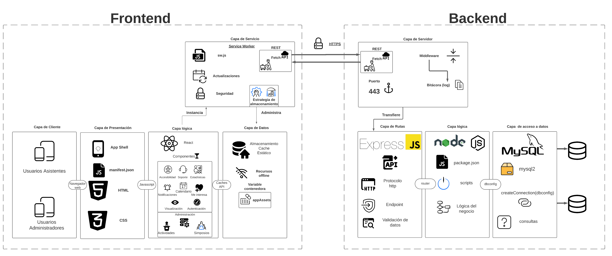

```
# SIMPOAPP


# Guía de Instalación del Sistema

Esta guía proporciona las instrucciones necesarias para instalar y configurar el sistema completo, que incluye la base de datos, el backend, y el frontend.

## Fase 1: Levantar Base de Datos

### Paso 1: Instalar Dependencias

- Node.js v20.9.0
- MySQL v8.0.35

### Paso 2: Descargar la Aplicación

Descargar la aplicación desde el repositorio en GitHub en la última versión.

### Paso 3: Configuración de la Base de Datos

1. Desde la raíz del repositorio, ir a la dirección `Backend/config/scripts`.
2. Ubicar el archivo que inicializa la base de datos, con un nombre similar a `SCRIPT_SRSE_VXX-X-XXXX`.
3. Desde una terminal de MySQL, ejecutar el siguiente comando:

```sh
source C:/ruta/al/archivo/SCRIPT_SRSE_VXX-X-XXXX;
```

Esto levantará la base de datos.

## Fase 2: Levantar el Backend

### Paso 1: Navegar al Directorio del Backend

Desde la raíz del repositorio, ir a la dirección `Backend/`.

### Paso 2: Crear el Archivo de Entorno

Crear un archivo llamado `.env` en el directorio `Backend/` con los siguientes parámetros:

```
PORT=<número_del_puerto>
DB_HOST=localhost
DB_USER=<usuario_de_la_base_de_datos>
DB_PASSWORD=<contraseña_de_la_base_de_datos>
DB_DATABASE=SRSE
SECRET_KEY=<llave_secreta_para_la_sesión>
VAPID_PRIVATE_KEY=<llave_privada_para_notificaciones>
VAPID_PUBLIC_KEY=<llave_pública_para_notificaciones>
```

### Paso 3: Ejecutar el Backend

Desde la raíz del repositorio, ir al directorio `Backend/` y ejecutar:

```sh
node src/app.js
```

Esto levantará el backend y la API.

## Fase 3: Levantar el Frontend

### Paso 1: Instalar Dependencias del Frontend

Desde la raíz del proyecto, ir al directorio `Frontend/` y ejecutar en la terminal:

```sh
npm run install
```

Esto incluirá las dependencias del archivo `package.json` en la carpeta `node_modules`.

### Paso 2: Construir el Frontend

Desde la misma terminal, ejecutar:

```sh
npm run build
```

Esto levantará una versión optimizada de la aplicación.

### Paso 3: Levantar el Frontend

Desde la misma terminal, ejecutar uno de los siguientes comandos según el modo deseado:

- Modo Producción:

```sh
npm run start
```

- Modo Desarrollo:

```sh
npm run dev
```

## Autores

- [Andrés Méndez Solano](https://github.com/Andres21sb)
- [Andrés Fallas Alvarado](https://github.com/andresjo21)
- [Isaías Víquez Soto](https://github.com/IsaiasV22)
- [Jose Daniel Chacón Araya](https://github.com/JDanielChaconA)
``` 
```  